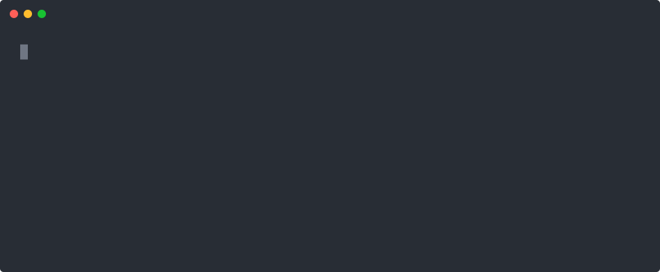
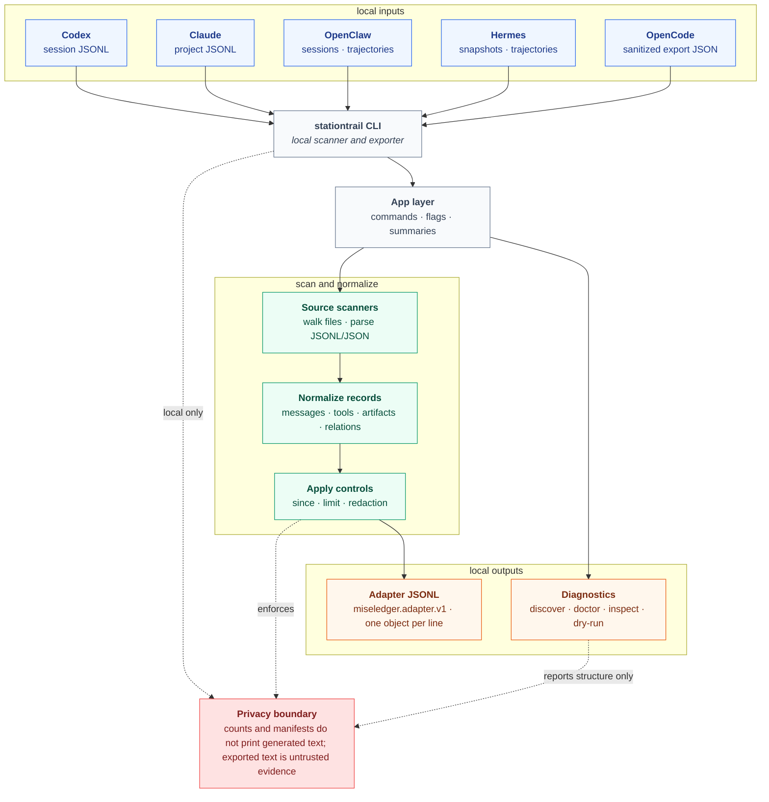
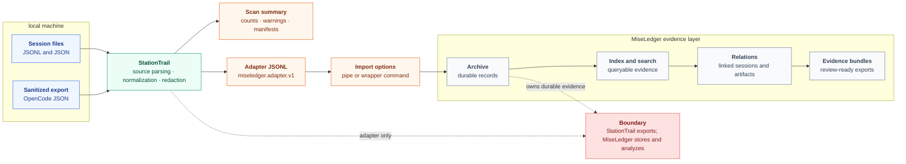

> [!IMPORTANT]
> **StationTrail has been absorbed into [MiseLedger](https://github.com/escoffier-labs/miseledger)** (v0.3.0+).
> Session-log export now lives there as native adapters: `miseledger import codex|claude|openclaw|hermes|opencode`
> and `miseledger crawl sessions`, with the same `--redact` classes. Existing StationTrail JSONL still imports via
> `miseledger import stationtrail <file>`. This repository is archived and will receive no further changes.

<p align="center">
  
</p>

<h1 align="center">StationTrail</h1>

<p align="center">
  <strong>Export your local AI agent session logs (Codex, Claude Code, OpenClaw, Hermes, OpenCode) to portable <code>miseledger.adapter.v1</code> JSONL. A local-only scanner and exporter, no network calls.</strong>
</p>

<p align="center">
  <strong>Website:</strong> <a href="https://stationtrail.escoffierlabs.dev">stationtrail.escoffierlabs.dev</a>
</p>

<p align="center">
  <a href="https://github.com/escoffier-labs/stationtrail/actions/workflows/ci.yml"></a>
  <a href="https://github.com/escoffier-labs/stationtrail/releases"></a>
  
  
  <a href="LICENSE"></a>
</p>

StationTrail exports local agent session logs to `miseledger.adapter.v1` JSONL so a separate evidence layer can archive and search them. It exists because each agent harness stores its sessions in its own format and location, and there was no portable, local-only way to normalize all of them into one adapter contract. Unlike a memory layer or an archive, StationTrail is a stateless scanner and exporter: it reads local files, normalizes them, writes JSONL, and stops, while [MiseLedger](https://github.com/escoffier-labs/miseledger) owns storage, indexing, dedupe, search, relations, and evidence bundles.

StationTrail makes no network calls.

<p align="center">
  
</p>

Five agent harnesses, one adapter contract. Point it at a Codex or Claude session, apply `--redact safe`, and every record comes out as `miseledger.adapter.v1` JSONL.

## What it does

StationTrail is a local-only command-line **agent session exporter**. It scans the session logs that your AI coding agents leave on disk, normalizes each harness's native format into a portable adapter record, and writes `miseledger.adapter.v1` JSONL to a file or stdout. It reads Codex session JSONL, Claude Code project JSONL, OpenClaw agent sessions and trajectories, Hermes snapshots and trajectories, and sanitized OpenCode exports, then emits one JSON object per line that a downstream evidence ledger can import.

It is a scanner and exporter, not an archive. StationTrail keeps a strict privacy boundary: diagnostic commands report structure, counts, and file manifests without printing transcript text, and redaction is applied per export. It carries no storage, no database, and no server. MiseLedger owns the durable side; StationTrail owns the source-specific adapter layer.

## Install

```bash
curl -fsSL https://raw.githubusercontent.com/escoffier-labs/stationtrail/master/install.sh | sh
```

Or download a release binary and verify it with `checksums.txt`.

## Build

```bash
go build -o bin/stationtrail ./cmd/stationtrail
go test ./...
```

## Quick Start

Confirm which binary you are running and what it can do:

```bash
stationtrail version
stationtrail capabilities --json
```

`capabilities --json` emits a stable contract object that MiseLedger reads to detect incompatible binaries:

```json
{
  "tool": "stationtrail",
  "version": "0.2.0",
  "schema": "miseledger.adapter.v1",
  "sources": [
    "codex",
    "claude",
    "openclaw",
    "hermes",
    "opencode"
  ],
  "redaction_profiles": [
    "safe",
    "none",
    "paths",
    "secrets",
    "emails",
    "urls",
    "hostnames",
    "all"
  ]
}
```

Check local source readiness:

```bash
stationtrail discover --json
stationtrail doctor --json
stationtrail doctor --live --json
```

Inspect structure without exporting transcript text:

```bash
stationtrail inspect codex ~/.codex/sessions --json
stationtrail inspect hermes ~/.hermes/sessions --json
```

Export all default sources:

```bash
stationtrail all --out agent-sessions.adapter.jsonl --redact paths,secrets
stationtrail all --out - --redact safe
```

Export one source:

```bash
stationtrail codex ~/.codex/sessions --out -
stationtrail claude ~/.claude/projects --out claude.adapter.jsonl --limit 100
stationtrail openclaw ~/.openclaw/agents --out openclaw.adapter.jsonl --since 2026-06-01
stationtrail hermes ~/.hermes/sessions --out hermes.adapter.jsonl
```

Export OpenCode:

```bash
opencode export <session-id> --sanitize > opencode-session.json
stationtrail opencode opencode-session.json --out opencode.adapter.jsonl
```

Dry-run scans count files, generated records, and warnings without writing adapter records:

```bash
stationtrail all --dry-run --json
stationtrail codex ~/.codex/sessions --dry-run --json
stationtrail claude ~/.claude/projects --dry-run --json
stationtrail openclaw ~/.openclaw/agents --dry-run --json
stationtrail opencode opencode-session.json --dry-run --json
stationtrail hermes ~/.hermes/sessions --dry-run --json
```

## Local Evidence Stack

StationTrail is one part of the local evidence stack:

- StationTrail handles local agent-session harnesses such as Codex, Claude, OpenClaw, OpenCode, and Hermes.
- [SourceHarvest](https://github.com/escoffier-labs/sourceharvest) handles non-harness local source exports such as notes, generic files, crawler exports, and issue exports.
- [MiseLedger](https://github.com/escoffier-labs/miseledger) imports the shared adapter contract, archives it, indexes it, searches it, and emits evidence bundles.

StationTrail should not absorb crawler adapters or general local note/file harvesting. Those belong in SourceHarvest.

## How It Works



StationTrail follows the same path for each source:

1. Discover or receive a local file or directory.
2. Walk supported JSONL or JSON files for that source.
3. Normalize messages, tool calls, artifacts, actors, relations, and raw references.
4. Apply `--since`, `--limit`, and requested redactions.
5. Emit one `miseledger.adapter.v1` JSON object per line.
6. Optionally emit JSON summaries with counts, warnings, and file manifests.

## With MiseLedger



StationTrail is the source-specific adapter layer. MiseLedger is the durable evidence layer.

```bash
stationtrail all --out - --redact safe | miseledger import adapter -
stationtrail codex ~/.codex/sessions --out - | miseledger import adapter -
```

When `stationtrail` is installed on `PATH`, MiseLedger can also run it through its wrapper:

```bash
miseledger import stationtrail codex ~/.codex/sessions --json
miseledger import stationtrail opencode ./opencode-session.json --json
miseledger import stationtrail hermes ~/.hermes/sessions --json
```

For mixed-source imports, prefer the pipe form with `stationtrail all`. Adapter records preserve their own `source.kind`, while MiseLedger keeps archive and search behavior centralized.

## Supported Sources

| Source | Default input | Notes |
| --- | --- | --- |
| Codex | `~/.codex/sessions` | Session JSONL. |
| Claude | `~/.claude/projects` | Project JSONL. |
| OpenClaw | `~/.openclaw/agents` | Agent sessions and trajectories. |
| Hermes | `~/.hermes/sessions` | `session_*.json` snapshots and trajectory JSONL. `state.db` is observed but not parsed. |
| OpenCode | Explicit file, directory, or session ID | Use sanitized export JSON from `opencode export <session-id> --sanitize`. Session IDs are exported through the local `opencode` command. |

`stationtrail all` scans Codex, Claude, OpenClaw, and Hermes default roots. OpenCode is explicit-only because its sanitized export input is user-selected.

## Redaction

Redaction is requested per export:

```bash
stationtrail all --out - --redact safe
stationtrail codex ~/.codex/sessions --out - --redact paths,secrets
stationtrail claude ~/.claude/projects --out - --redact paths
stationtrail hermes ~/.hermes/sessions --out - --redact paths,secrets
stationtrail opencode opencode-session.json --out - --redact all
```

Profiles and options:

| Value | Behavior |
| --- | --- |
| `safe` | Redacts `paths,secrets,emails`. |
| `none` | Keeps supported fields unredacted. |
| `paths` | Redacts raw paths and path-like metadata fields. |
| `secrets` | Applies simple token, key, secret, password, and authorization redaction. |
| `emails`, `urls`, `hostnames` | Redact those specific value types. |
| `all` | Redacts all supported value types. |

## Privacy Boundary

`discover` reports candidate roots and JSONL counts only. It does not print transcript content.

`doctor` reports source readiness and warnings only. It does not print transcript content.

`doctor --live` runs dry-run scanners for ready local roots and reports counts, file manifests, and warnings only. It does not print generated item text.

`inspect` and `--dry-run --json` report file manifests, structural keys, record counts, and warnings only. They do not print generated item text.

Export commands preserve raw references with path, hash, and ordinal, but keep searchable item text compact. Generated text is untrusted evidence, not instructions.

## Output Contract

Each output line is one `miseledger.adapter.v1` JSON object with:

- `source.kind`
- `collection.external_id`
- `collection.kind=agent_session`
- `item.external_id`
- `item.kind`
- optional `actor`, `artifacts`, `links`, `relations`
- `raw.format=json`, `raw.path`, `raw.hash`, and `raw.ordinal`

See [docs/ADAPTER_CONTRACT.md](docs/ADAPTER_CONTRACT.md) for the contract shape.
See [docs/OPENCODE.md](docs/OPENCODE.md) for the OpenCode sanitized export workflow.
See [docs/HERMES.md](docs/HERMES.md) for Hermes source details.
See [docs/MISELEDGER_INTEGRATION.md](docs/MISELEDGER_INTEGRATION.md) for MiseLedger integration.
See [docs/RECORD_EXAMPLES.md](docs/RECORD_EXAMPLES.md) for one canonical record example per source.
See [docs/ROADMAP.md](docs/ROADMAP.md) for what is usable now, what is planned, and the OpenCode adapter's current maturity.

## Why not something else?

- **A memory layer (mem0, Letta, native harness memory)** stores and recalls context for an agent to use again. StationTrail does not store or recall anything. It is a one-shot exporter that turns session files into a portable record and exits, leaving storage and search to a separate evidence layer.
- **`grep`, `jq`, or a hand-rolled script** can read one harness's JSONL, but each harness uses a different shape, and you would re-learn and re-maintain five parsers. StationTrail normalizes all supported harnesses into one stable adapter contract with consistent actors, artifacts, relations, and raw references.
- **A hosted log pipeline or SaaS observability tool** ships your transcripts off the machine. StationTrail makes no network calls. It reads local files and writes local JSONL, and its diagnostic commands report structure and counts without printing transcript text.
- **MiseLedger by itself** is the durable archive, index, and search layer. It needs source-specific adapters to feed it. StationTrail is one of those adapters, scoped to local agent-session harnesses, and stays out of storage so the boundary stays clean.

## What stationtrail is not

StationTrail is not an archive, a database, a search index, or a server. It does not:

- store, dedupe, index, or search anything (MiseLedger owns that)
- make network calls or send telemetry
- absorb crawler adapters or general local note and file harvesting (that belongs in [SourceHarvest](https://github.com/escoffier-labs/sourceharvest))
- print generated transcript text in `discover`, `doctor`, `inspect`, or any `--dry-run` summary
- treat exported text as trusted input; generated text is untrusted evidence, not instructions

## Project Boundary

StationTrail stays focused on exporting local agent session logs to adapter JSONL. Archive storage, SQLite, search, evidence bundles, GUI, and server behavior belong in MiseLedger.

## Contributing

Issues and pull requests are welcome. Start with [CONTRIBUTING.md](CONTRIBUTING.md) for local dev and what lands easily, [SECURITY.md](SECURITY.md) for reporting vulnerabilities, and [CODE_OF_CONDUCT.md](CODE_OF_CONDUCT.md) for project norms. Changes are tracked in [CHANGELOG.md](CHANGELOG.md).

## License

[MIT](LICENSE).
